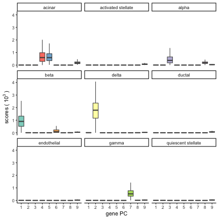

This document provides three examples of how to use `epca` to explore your data.

## Example 1: simulated data

The first example shows how to call the two key functions: `sca` and `sma`.
Let's simulate a rank-5 data matrix with some additive Gaussian noise.

```r
n <- 300
p <- 50
k <- 5
Z <- shrinkage(svd(matrix(runif(n * k), n, k))$u, gamma = sqrt(n))
B <- diag(5) * 3
Y <- shrinkage(svd(matrix(runif(p * k), p, k))$u, gamma = sqrt(p))
E <- matrix(rnorm(n * p, sd = 0.01), n, p)
X <- scale(Z %*% B %*% t(Y) + E)
```
In the above code, matrices `Z` and `Y` are rank-5 and sparse. The `shrinkage()` function performs a soft-thresholding by default.

Now, apply `sca` to find 5 sparse PCs. 

```r
s.sca <- sca(X, k = 5)
s.sca
```

```
## Call:sca(A = X, k = 5)
## 
## 
## Num. non-zero loadings': 20 21 33 29 19 
## Abs. sum loadings': 3.480141 
## Cumulative proportion of variance explained (CPVE): 
##                      CPVE
## First component:    0.097
## First 2 components: 0.188
## First 3 components: 0.281
## First 4 components: 0.356
## First 5 components: 0.384
```

Similarly, we can do sparse matrix decomposition.

```r
s.sma <- sma(X, k = 5)
s.sma
```

```
## Call: sma(A = X, k = 5)
## 
## 
## Num. non-zero Z's:  164 178 170 202 217 
## Num. non-zero Y's:  22 21 33 27 21 
## Abs. sum Z's:  8.681909 
## Abs. sum Y's:  3.481118
```

## Example 2: `pitprops` data 
For the second example example, we use the `pitprops` data.

We apply the `sca` function to find `k = 3` sparse PCs with sparsity parameter `gamma = 4.5`. Here, the sparsity parameter (`gamma`) controls the L1 norm of the returned PC loadings. The default of `gamma` (if absent) is `sqrt(p * k)`, where `p` is the number of original variables. 

```r
data("pitprops", package = "epca")
s.sca <- sca(pitprops, k = 3, gamma = 4.5)
print(s.sca, verbose = TRUE)
```

```
## Call:sca(A = pitprops, k = 3, gamma = 4.5)
## 
## 
## Num. non-zero loadings': 8 8 6 
## Abs. sum loadings': 1.696596 
## Cumulative proportion of variance explained (CPVE): 
##                      CPVE
## First component:    0.349
## First 2 components: 0.605
## First 3 components: 0.768
## 
##  Component  1 :
## 
##   feature loadings
## 1 topdiam 0.343   
## 2 length  0.345   
## 3 ovensg  -0.143  
## 4 ringbut 0.07    
## 5 bowmax  0.209   
## 6 bowdist 0.294   
## 7 whorls  0.212   
## 8 knots   -0.079  
## 
##  Component  2 :
## 
##   feature loadings
## 1 testsg  0.008   
## 2 ovensg  0.353   
## 3 ringtop 0.382   
## 4 ringbut 0.273   
## 5 whorls  0.051   
## 6 clear   -0.077  
## 7 knots   -0.049  
## 8 diaknot -0.339  
## 
##  Component  3 :
## 
##   feature loadings
## 1 topdiam 0.028   
## 2 moist   0.507   
## 3 testsg  0.537   
## 4 ringtop 0.052   
## 5 bowmax  -0.088  
## 6 knots   0.06
```
Here, option `verbose = TRUE` prints, for each PC, the original variable with non-zero loadings.

The followings find 6 sparse PCs with `gamma = 6`. Note that the sparsity parameter for 

```r
s.sca <- sca(pitprops, 6, gamma = 6)
print(s.sca, verbose = TRUE)
```

```
## Call:sca(A = pitprops, k = 6, gamma = 6)
## 
## 
## Num. non-zero loadings': 6 2 2 3 4 3 
## Abs. sum loadings': 1.163234 
## Cumulative proportion of variance explained (CPVE): 
##                      CPVE
## First component:    0.250
## First 2 components: 0.397
## First 3 components: 0.482
## First 4 components: 0.600
## First 5 components: 0.722
## First 6 components: 0.839
## 
##  Component  1 :
## 
##   feature loadings
## 1 topdiam 0.333   
## 2 length  0.336   
## 3 ovensg  -0.18   
## 4 bowmax  0.017   
## 5 bowdist 0.22    
## 6 whorls  0.078   
## 
##  Component  2 :
## 
##   feature loadings
## 1 moist   0.498   
## 2 testsg  0.527   
## 
##  Component  3 :
## 
##   feature loadings
## 1 whorls  -0.087  
## 2 clear   0.761   
## 
##  Component  4 :
## 
##   feature loadings
## 1 ovensg  -0.283  
## 2 bowmax  -0.058  
## 3 knots   0.633   
## 
##  Component  5 :
## 
##   feature loadings
## 1 ovensg  0.142   
## 2 ringtop 0.531   
## 3 ringbut 0.246   
## 4 bowmax  -0.171  
## 
##  Component  6 :
## 
##   feature loadings
## 1 bowmax  -0.24   
## 2 whorls  -0.034  
## 3 diaknot 0.625
```

## Example 3: single-cell RNA-seq data


This example shows a large-scale application of sparse PCA to a single-cell RNA-seq data. 
For this example, we use the human/mouse pancreas single-cell RNA-seq data from Baron et al. (2017). 


Fe used the single-cell RNA-seq data with the `scRNAseq` package. We removed the genes that do not have any variation across samples (i.e., zero standard deviation) and the cell types that contain fewer than 100 cells. This resulted in a sparse data matrix `pancreas` of 17499 genes (rows) and 8451 cells (columns) across nine cell types.

```r
dat <- BaronPancreasData("human")
gene.select <- !!apply(counts(dat), 1, sd)
label.select <- colData(dat) %>% data.frame() %>% dplyr::count(label) %>% filter(n > 
    100)
dat1 <- dat[gene.select, colData(dat)$label %in% label.select$label]
```

For SCA, we use the expression count matrix (`count`) as the input, where `count[i,j]` is the expression level of gene j in cell i, with 10.8\% being non-zero. 

```r
count <- counts(dat1)
```

The dataset contains labels for each cell.

```r
label <- setNames(factor(dat1$label), colnames(dat1))
```

Next, We applied `sca` to the transpose of `count` to find `k = 9` sparse gene PCs. Aiming for a small number of genes (i.e., non-zero loadings) in individual PCs, we set the sparsity parameter to `gamma = log(pk)`, which is approximately 12. 
<!-- The algorithm took 24 iterations and about 5 minutes on a single processor (3.3GHz). -->

```r
scar <- sca(t(count), k = 9, gamma = 12, center = F, scale = F, epsilon = 0.001)
```

We can exam the number of original genes included by each gene PC. 

```r
n.gene <- apply(!!scar$loadings, 2, sum)
n.gene
```

```
## PC1 PC2 PC3 PC4 PC5 PC6 PC7 PC8 PC9 
##   1   1   1   8  15   1   1   3  61
```
Each gene PC uses a handful of original genes. 


We can plot the component scores of the nine PCs, with `dplyr` and `ggplot2` packages. Each panel displays one of nine cell types with the names of cell types and the number of cells reported on the top strips. For each cell type, a box depicts the component scores for nine sparse gene PCs.

```r
scar$scores %>% reshape2::melt(varnames = c("cell", "PC"), value.name = "scores") %>% 
    mutate(PC = factor(PC), label = label[cell]) %>% ggplot(aes(PC, scores/1000, 
    fill = PC)) + geom_boxplot(color = "grey30", outlier.shape = NA, show.legend = FALSE) + 
    labs(x = "gene PC", y = bquote("scores (" ~ 10^3 ~ ")")) + scale_x_discrete(labels = 1:9) + 
    facet_wrap(~label, nrow = 3) + scale_fill_brewer(palette = "Set3") + theme_classic()
```



We observed that most of the gene PCs consist of one or a handful of genes, yet the component scores showed that these PCs distinguish different cell types effectively . For example, the PC 2 consists of only one gene (named SST), and the expression of the gene marks the "delta" cells among others. This result highlights power of scRNA-seq in capture cell-type specific information and suggests the applicability of our methods to biological data.
